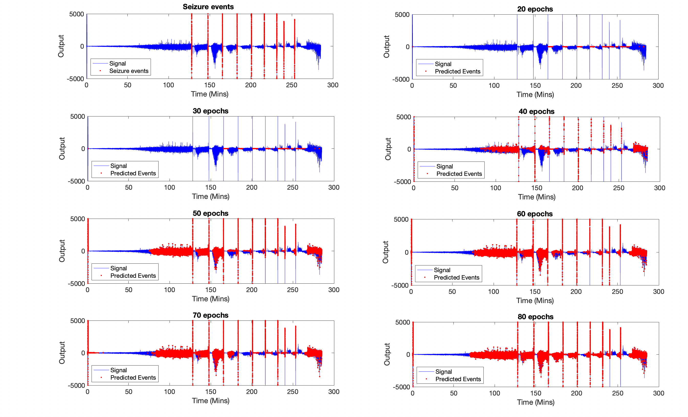

# MATLAB-seizure-detection
A Seizure Classification LSTM model has been created using Matlab. Research conducted in Professor Woodhall's lab at Aston University obtained the local field potentials of epileptic and control rats used in this deep learning project. 

# Abstract
Epilepsy is a neurological disorder characterised by two or more unexplained seizures, disrupting everyday life for patients suffering from this chronic condition (Stafstrom & Carmant., 2015). Currently, around thirty percent of patients are not responding to drug therapy (Schmidt and Schachter, 2014), and despite the many non-pharmacological options available for controlling seizures, such as the ketogenic diet, epilepsy surgery, and neuromodulatory devices such as vagus nerve stimulation (VNS), a large percentage of patients continue to suffer from uncontrolled seizures (Sirven, 2015). With the advancement of artificial intelligence and an era where technology and healthcare can coexist, automated seizure prediction techniques could benefit not only epilepsy patients but also family, caregivers, and medical personnel and alleviate socioeconomic burdens (Pugliatti et al., 2007). For the first time, this paper proposes a deep learning Long short-term memory (LSTM) network model with MATLAB R2021b for automatic prediction of epileptic seizures based on local field potential data. The model was trained on a labelled dataset of seizure and non-seizure data, and three unseen test channels were used to perform a preliminary evaluation of model performance. Model parameters were chosen based on similar studies and through trial and error; however, the LSTM model is a 'black-box' approach making it a challenge to ensure that the model has been optimised effectively. The model was most effective at 40 epochs, where it produced an average classification accuracy of 98.8%, sensitivity of 38.7%, specificity of 99.2%, precision of 22.9%, and an F1 score of 0.3. Despite the model's successful accuracy and specificity scores, a critical examination of machine learning algorithms and comparison with existing literature revealed the model's several limitations. These limits include a significant class imbalance, where the number of non-seizure events in comparison to seizure events was significantly out of proportion, and its failure to detect pre-ictal seizure events at a lower number of epochs. In view of this, there is scope for improving the model to both enhance the performance of early seizure detection and produce reliable results before a further application can be considered. Using this model as a foundation, future research can improve and possibly develop real-life algorithms to improve the quality of life for patients with uncontrollable seizures.
